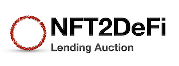

# NFT2DeFi Lending Auctions
NFT Lending protocol and dapp allows borrowers to find best lenders via auction and both sides to further engage in DeFi

## Description
Owners of NFTs can get loans by using their NFTs as collateral. In order to find the best lender, they set up auctions, in which each lender competes for the lowest loan repayment amount.
During the auction, each bidder (potential lender) deposits a specified amount in order to participate. The deposit is returned, as soon as a better bidder arrives, so if a bidder loses the auction, their deposit is immediately returned. 
After the auction the borrower can activate the loan to use and further engage in DeFi. The lender can safely profit from the collateralized loan repayment or liquidation. If the lender does not authorize the transfer or has insufficient funds, the borrower gets to keep the deposit, get the collateral back and terminate the loan. If the borrower fails to repay the loan on time, the lender can liquidate the loan and keep the collateral. If the borrower fails to initiate the loan, he can keep the deposit, but lose the collateral. 

## How it’s made:
Written in Solidity and JavaScript and using React and ethers-js.
Using Hardhat toolset.
Smart contracts deployed on Polygon Mumbai Testnet and Harmony Testnet Shard 0. 

The list of auctions, the auction process and the lending process are all in one smart contract. 

## Demo
[Demo](https://gateway.pinata.cloud/ipfs/QmYkpybwgRj7HfmSVhu18evGEaEGhvXnDWhSJCJRPJwXbw/)